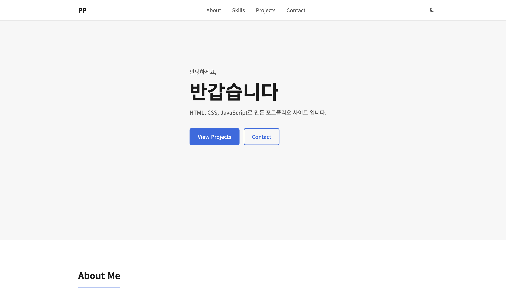
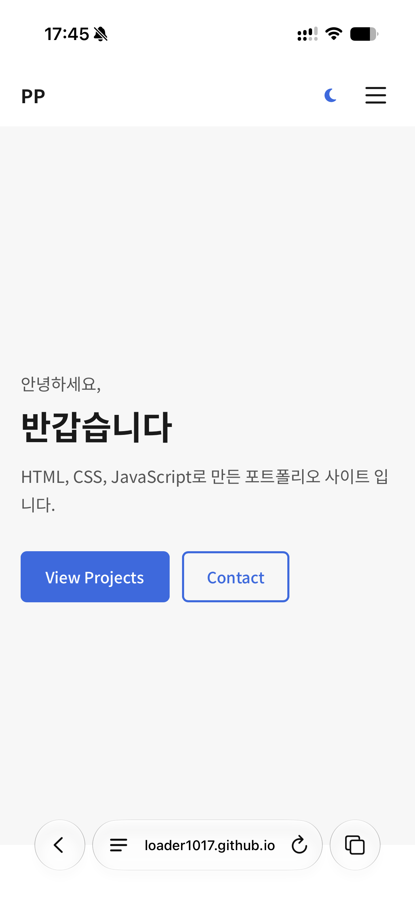
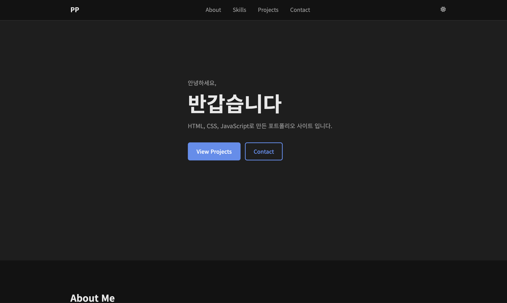

# SungEun | Portfolio

AI/SW 기초 과정 — 웹 기초와 프론트엔드 미션  
순수 HTML / CSS / JavaScript 만으로 제작한 반응형 포트폴리오

---

## 배포 URL

**https://loader1017.github.io/b4-1**

---

## 스크린샷

### 데스크톱


### 모바일


### 다크 모드


---

## 사용 기술

| 구분 | 내용 |
|------|------|
| 마크업 | HTML5 (시맨틱 태그) |
| 스타일 | CSS3 (Flexbox, Grid, CSS 변수, 미디어 쿼리) |
| 동작 | Vanilla JavaScript ES6+ |
| 아이콘 | Font Awesome 6 |
| API | GitHub REST API v3 |
| 배포 | GitHub Pages |

외부 프레임워크 미사용 (React, Vue, jQuery, Bootstrap, Tailwind 등)

---

## 프로젝트 구조

```
portfolio/
├── index.html
├── css/
│   └── style.css
├── js/
│   └── main.js
├── images/
└── README.md
```

---

## 구현 기능 및 기준값

### 인터랙션 기준값
| 기능 | 기준값 |
|------|--------|
| nav 배경 변경 | 스크롤 **60px** 이상 |
| 스크롤 탑 버튼 표시 | 스크롤 **300px** 이상 |
| 스크롤 애니메이션 threshold | **0.15** |

### GitHub API 상태 처리
- 로딩: 스피너 표시
- 성공: 저장소 카드 렌더링
- 에러: 에러 메시지 + 재시도 버튼 (403 레이트 리밋 포함)
- 빈 상태: "표시할 프로젝트가 없습니다" 메시지

### 이벤트 → 상태 → 렌더링 흐름
1. 다크 모드 토글 → isDark 변경 → data-theme 속성 + localStorage
2. API 호출 → loading/success/error/empty 상태 → Projects UI
3. 폼 입력/제출 → validationState 변경 → 에러 메시지 show/hide
4. 필터 버튼 클릭 → currentLang 변경 → 카드 목록 재렌더링

---

## 주의사항

GitHub API는 인증 없이 시간당 60회 요청 제한이 있습니다.  
403 응답 발생 시 에러 UI가 표시되며, 재시도 버튼으로 다시 호출할 수 있습니다.
